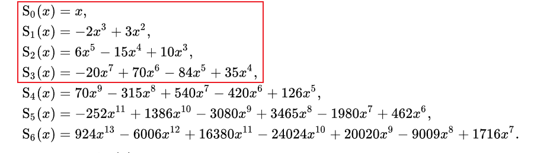
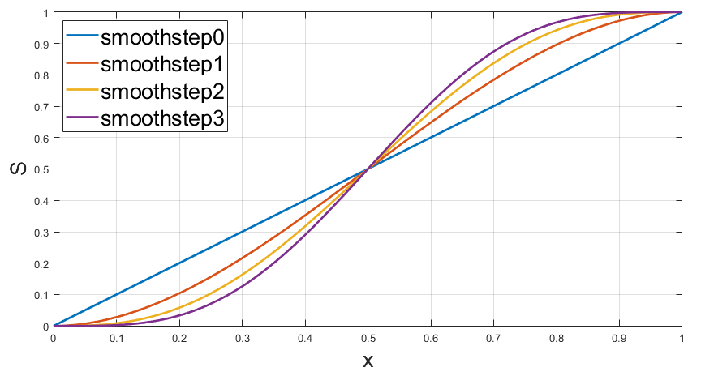
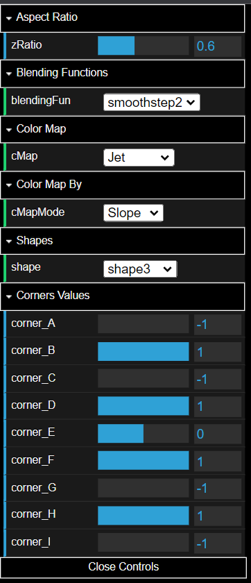
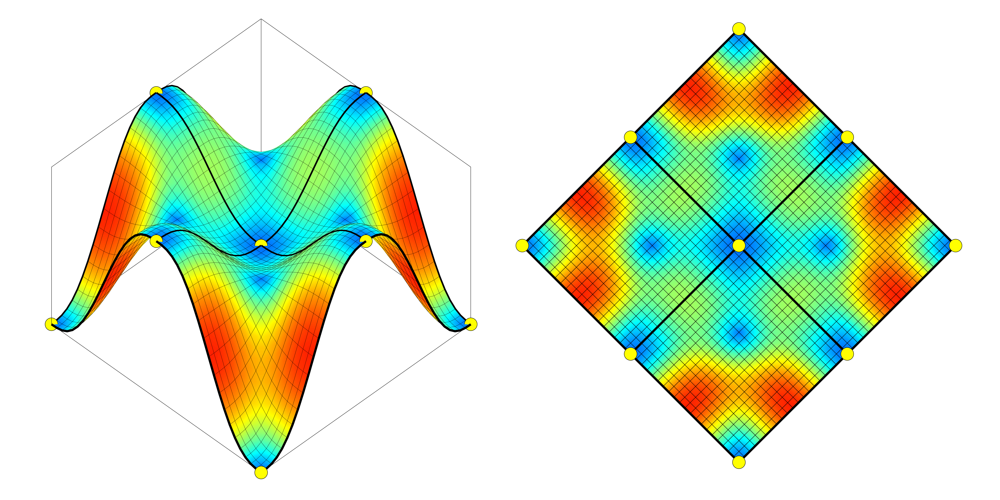

# 2D Piecewise Function Demo

## [LINK TO DEMO ...](https://geniosainz.github.io/2D-Piecewise-Function/)

This [demo](https://geniosainz.github.io/2D-Piecewise-Function/) implemented in JavaScript is based on the amazing video [``Painting a Landscape with Maths´´](https://www.youtube.com/watch?v=BFld4EBO2RE&t=157s) by [Inigo Quilez](https://iquilezles.org/) in which he explains how to generate a landscape procedurally by adding terrain, vegetation, clouds and lighting models. 

The demo focuses on the part of the video where Iñigo models the terrain as a surface formed by square tiles defined by a grid of corners. To guarantee the connectivity between the tiles $f_{ij}$, the value of the grid corners $a,b,c,d$ of the shared cells has to be fixed. The connectivity is done in a smooth way using the [smoothstep](https://en.wikipedia.org/wiki/Smoothstep#:~:text=The%20function%20receives%20a%20real,is%20zero%20at%20both%20edges.) family of functions $S$.

$$\begin{eqnarray} 
     f_{ij}(x,y) = a_{ij} & + & (b_{ij}-a_{ij})S(x-i)+(c_{ij}-a_{ij})S(y-j) \\
                          & + & (a_{ij}-b_{ij}-c_{ij}+d_{ij})S(x-i)S(y-j)
\end{eqnarray}$$


Smoothstep family of curves:

```js
let S = {
         smoothstep0: (x)=>  x,
         smoothstep1: (x)=> -2*x**3+3*x**2,
         smoothstep2: (x)=>  6*x**5-15*x**4+10*x**3,
         smoothstep3: (x)=> -20*x**7+70*x**6-84*x**5+35*x**4,
        }                     
```

Shape of the functions:


## DEMO FEATURES

The gui uses [dat.GUI](https://github.com/dataarts/dat.gui) and allows:

- Varying the colour map and aspect ratio of the surface.
- The possibility to choose between the four smoothstep functions by modifying the interpolation and thus varying the shape of the surface. I have included the smoothstep0 function (linear function) to demonstrate that the connectivity is not smooth.
- The possibility to choose from predefined surface shapes.
- The possibility to change the value of the shared corners by means of sliders, thus modifying the local shape of the surface.

<p align="center"></p>

## MATLAB IMPLEMENTATION

I have programmed some Matlab scripts to generate animations of transitions of different values of the grid corners. In these examples the colour map is defined by the module of the gradient vector of the surface, giving a sense of how deformed the surface is.




